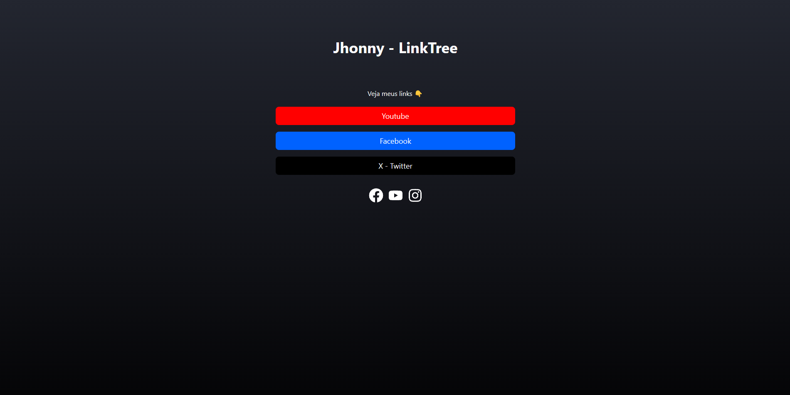
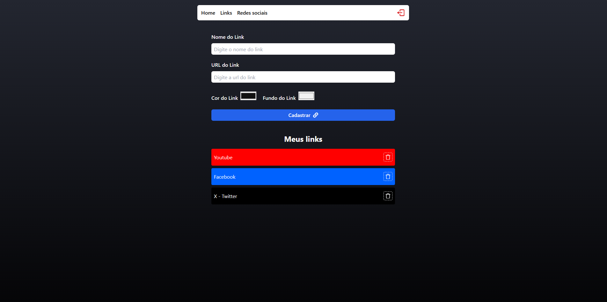
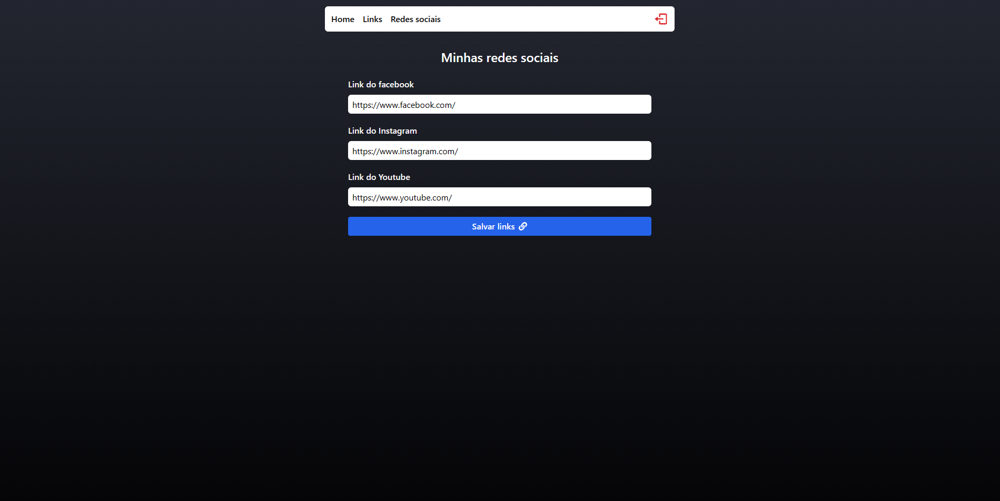

<h1 align="center" style="font-weight: bold;">Personal LinkTree 🌲</h1>

<p align="center">
    <b>This project is a personal LinkTree</b>
</p>

<h2 id="layout">🎨 Layout</h2>

<p align="center">
    
    
    
</p>

<h2 id="technologies">💻 Technologies</h2>

- React
- TypeScript
- TailwindCSS
- Firebase
- React Router Dom

<h2 id="started">🚀 Getting started</h2>

<h3>Prerequisites</h3>

Here you list all prerequisites necessary for running your project. For example:

- [NodeJS](https://github.com/)
- [Git](https://github.com)

<h3>Cloning</h3>

How to clone your project

```bash
git clone https://github.com/jjhonny/linktree.git
```

<h3>Starting</h3>

How to start your project

```bash
cd project-name
npm install
npm run dev
```
